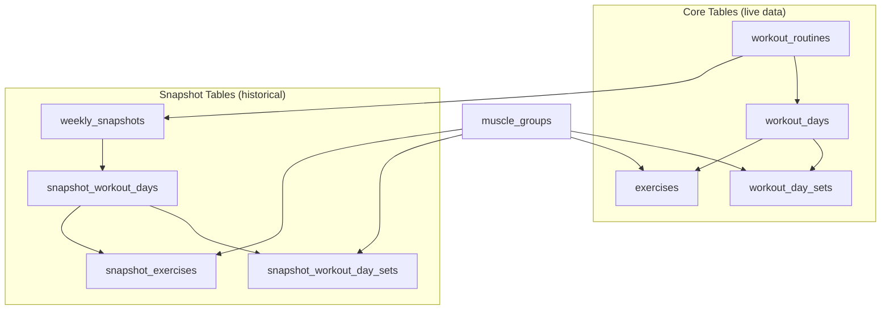
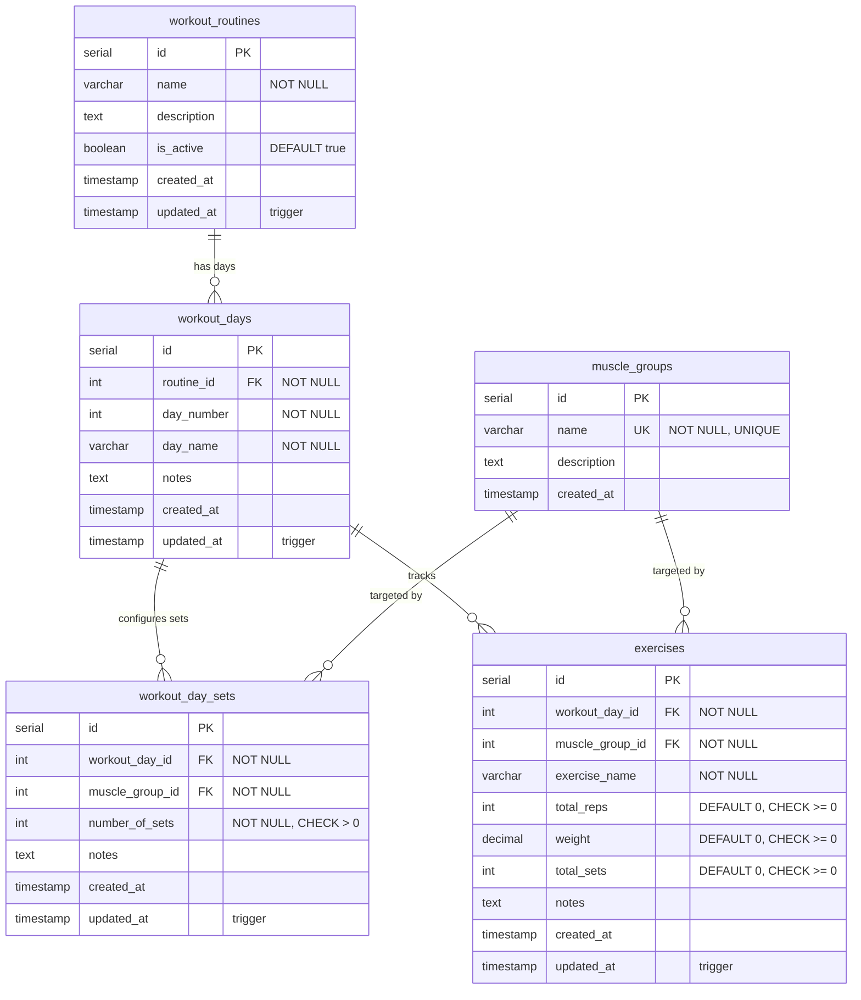
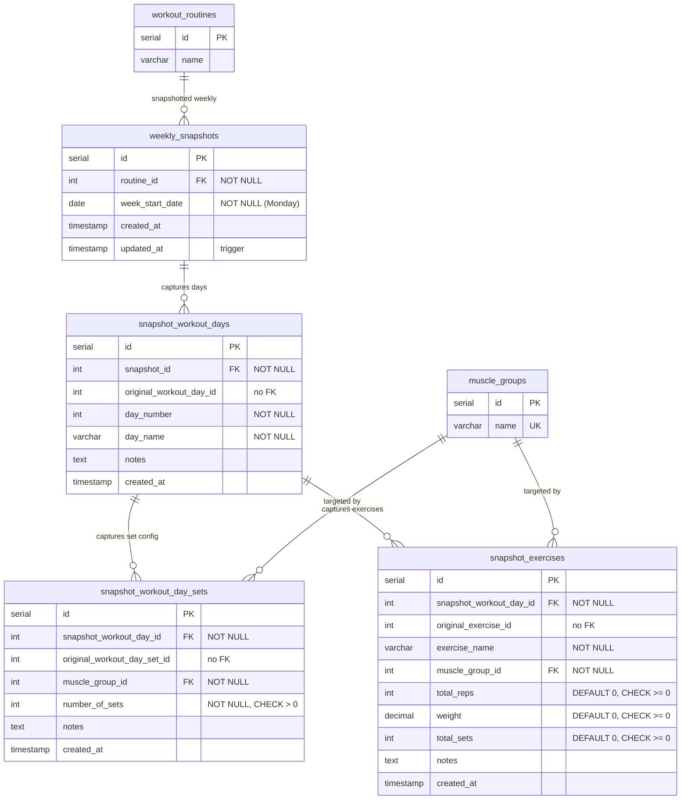
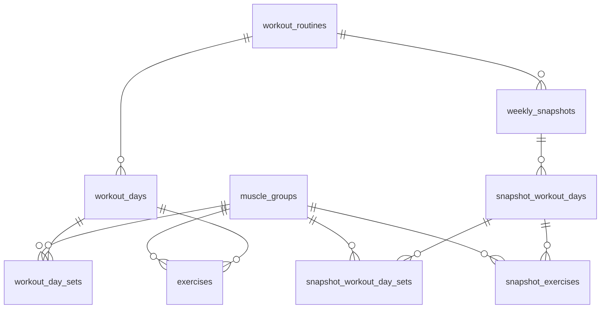
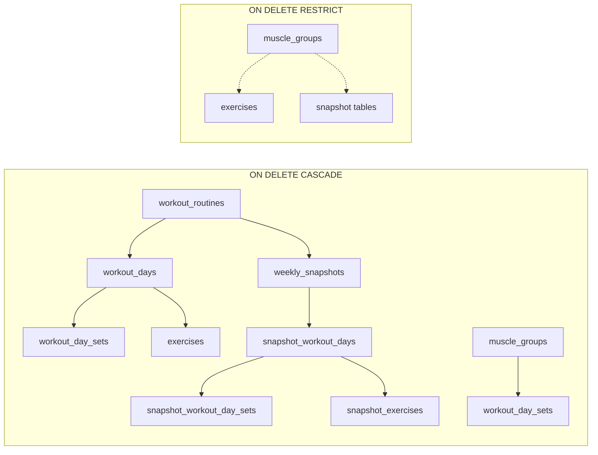

# XQ Fitness Database Schema

Visual reference for the PostgreSQL 16 schema (`xq_fitness`). Source of truth: `schemas/schema.sql` + `migrations/`. Current shape after migration `004_update_exercises_to_simplified_model.sql`.

## High-Level Architecture

Two parallel domains share `muscle_groups` as a reference table:

- **Core** — live workout routine definitions and exercise progress
- **Snapshot** — weekly point-in-time captures of routine state

## Core Tables ER Diagram

**Unique constraints (core):**

| Table | Constraint | Columns |
|-------|------------|---------|
| `workout_days` | `unique_day_per_routine` | `(routine_id, day_number)` |
| `workout_day_sets` | `unique_muscle_per_day` | `(workout_day_id, muscle_group_id)` |

## Snapshot Tables ER Diagram

Snapshots copy routine state at week boundaries. `original_*` columns store source row IDs **without FK constraints** so historical records survive source deletion.

**Unique constraints (snapshot):**

| Table | Constraint | Columns |
|-------|------------|---------|
| `weekly_snapshots` | `unique_snapshot_per_week` | `(routine_id, week_start_date)` |
| `snapshot_workout_days` | `unique_day_per_snapshot` | `(snapshot_id, day_number)` |
| `snapshot_workout_day_sets` | `unique_muscle_per_snapshot_day` | `(snapshot_workout_day_id, muscle_group_id)` |

## Full Combined ER Diagram

## Delete Behavior

| Parent | Child | ON DELETE |
|--------|-------|-----------|
| `workout_routines` | `workout_days`, `weekly_snapshots` | CASCADE |
| `workout_days` | `workout_day_sets`, `exercises` | CASCADE |
| `muscle_groups` | `workout_day_sets` | CASCADE |
| `muscle_groups` | `exercises`, snapshot muscle FKs | RESTRICT |
| `weekly_snapshots` | `snapshot_workout_days` | CASCADE |
| `snapshot_workout_days` | `snapshot_workout_day_sets`, `snapshot_exercises` | CASCADE |

## Data Flow: Weekly Snapshot

When a weekly snapshot is created (application logic in `write-service`):

1. Read current `workout_days`, `workout_day_sets`, and `exercises` for the routine
2. Insert `weekly_snapshots` row for `(routine_id, week_start_date)`
3. Copy days → `snapshot_workout_days` (store `original_workout_day_id`)
4. Copy set config → `snapshot_workout_day_sets` (store `original_workout_day_set_id`)
5. Copy exercises → `snapshot_exercises` (store `original_exercise_id`)
6. Reset live set counters on the routine

## Reference Data

`muscle_groups` is seeded with 13 rows (12 in `schemas/seed.sql` + Abductor in migration 002).

## Viewing These Diagrams

- **GitHub** — Mermaid renders natively in this file
- **VS Code / Cursor** — use Markdown preview
- **Prisma Studio** — `npx prisma studio` for live data browser (requires running DB)
